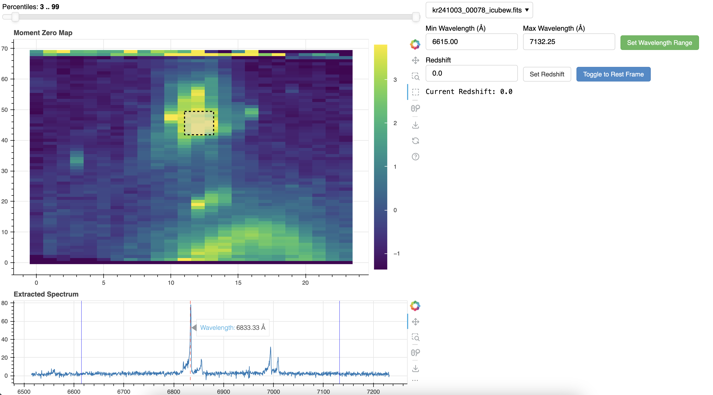

# CubeViewer
Quicklook KCWI/KCRM cube visualizer with spectral extraction. 




## Dependancies 
- bokeh 
- numpy 
- astropy
- matplotlib

## Usage 

To run the app, `cd` to the directory with `app.py` (its not installable; you can move this file wherever is convenient), and run 

```
bokeh serve app.py --args --dir /path/to/fits/cubes
```

where you point `--dir` to a folder containing at least 1 `cubew.fits` or `cubes.fits` file. 

Then navigate to `localhost:5006/app` in your browser to access the app. 

A drop down menu at the top lets you switch between different valid fits cubes in the directory. 

To change the wavelength range over which the moment 0 map is computed, set the wavelength minimum and maximum. The blue vertical bars in the spectrum below show what range you're computing over. 

To extract a 1D spectrum from a region of your map, click the box-select tool (the one without a magnifying glass) and drag over a region. A 1D spectrum will appear below. Mousing over the lower plot will show the wavelength. 

To convert the axes between restframe and observed frame, enter a redshift and hit "set redshift", then you can use the toggle. 

